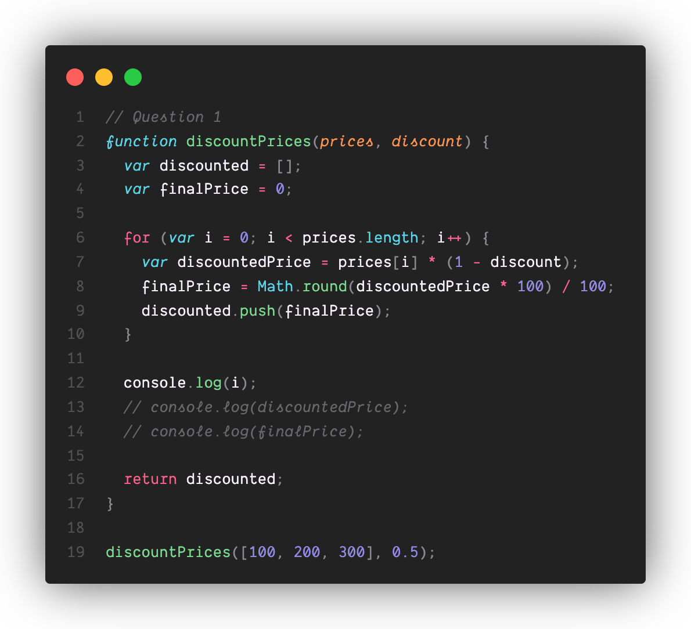
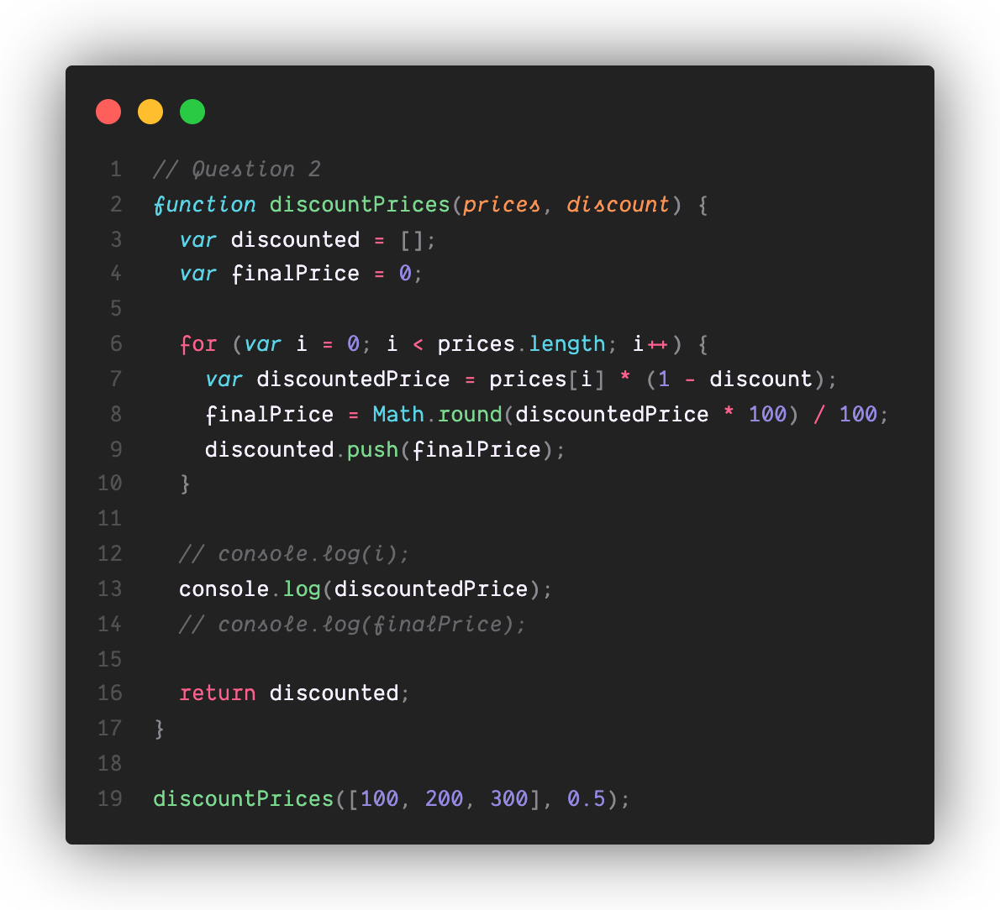
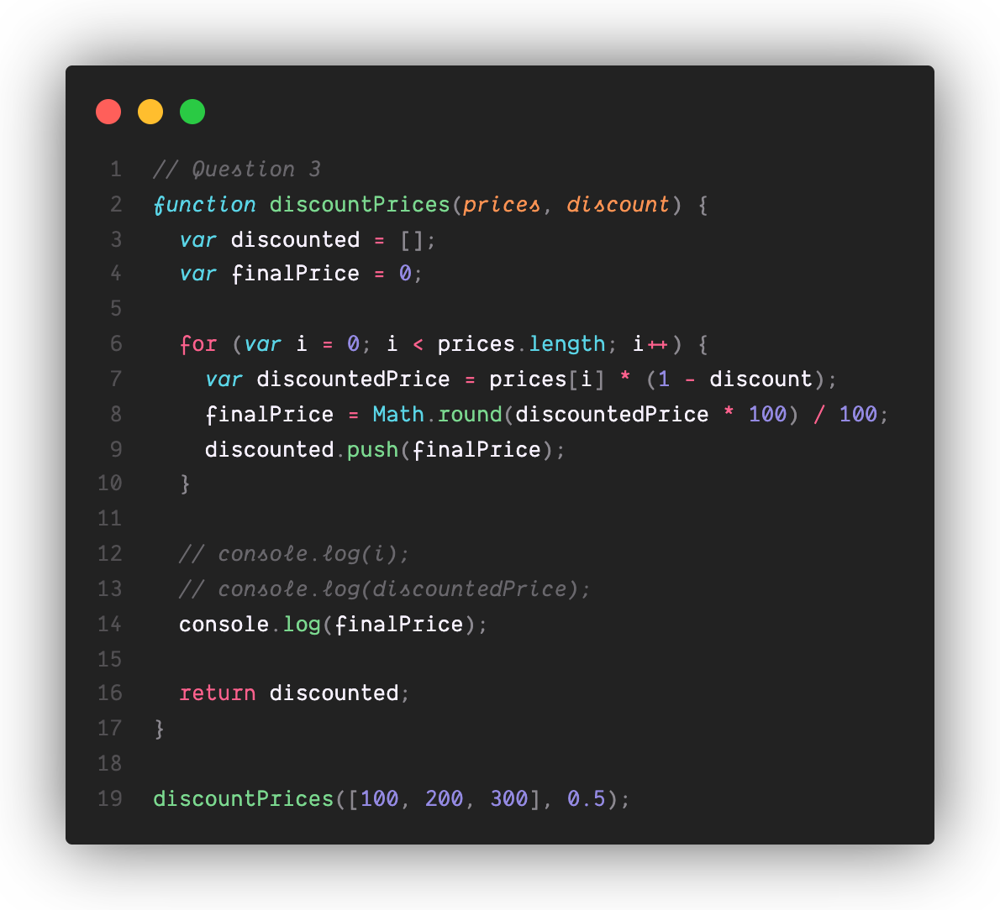
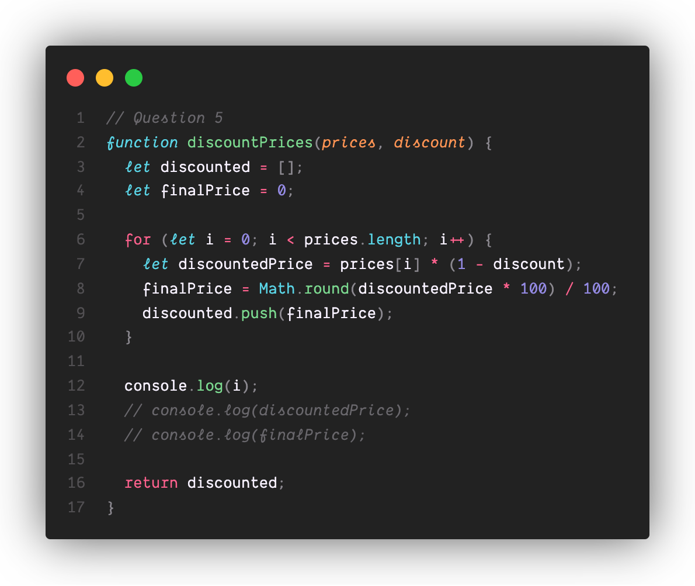
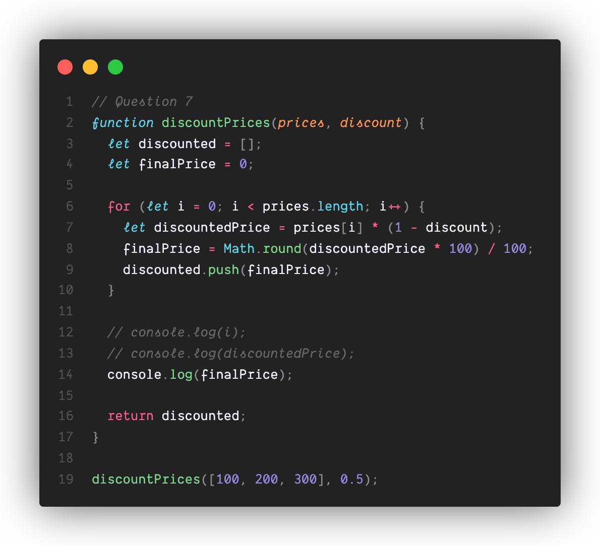
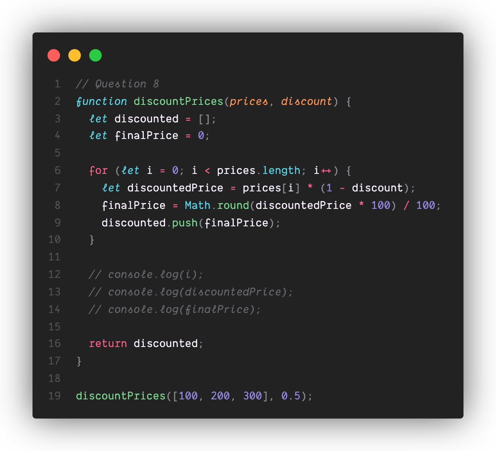
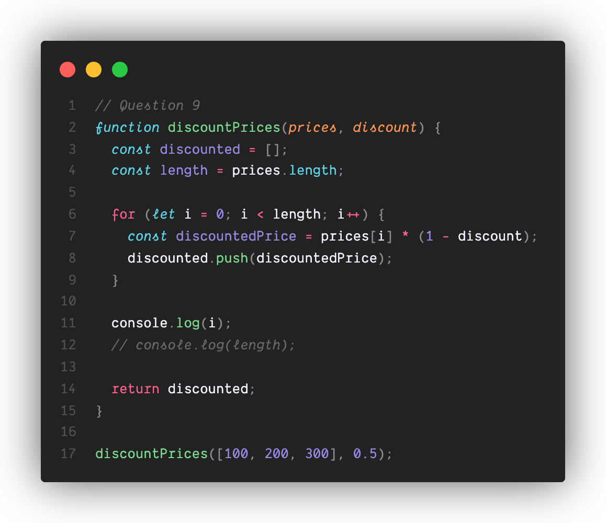
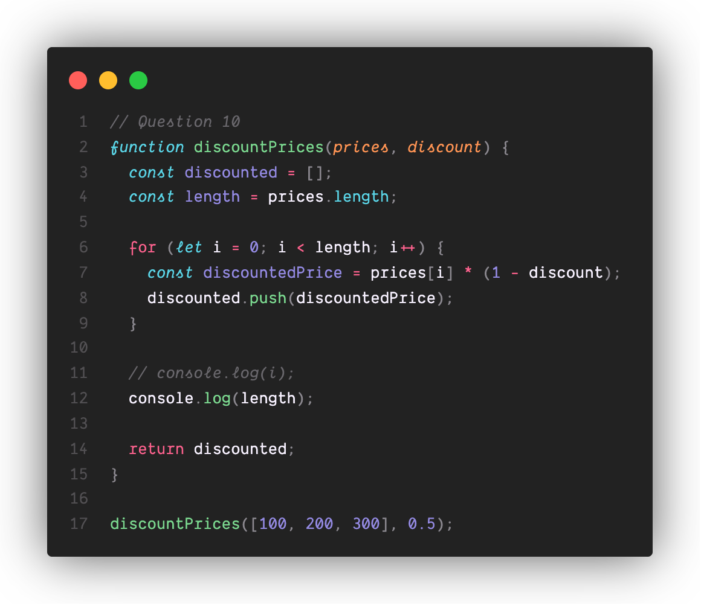
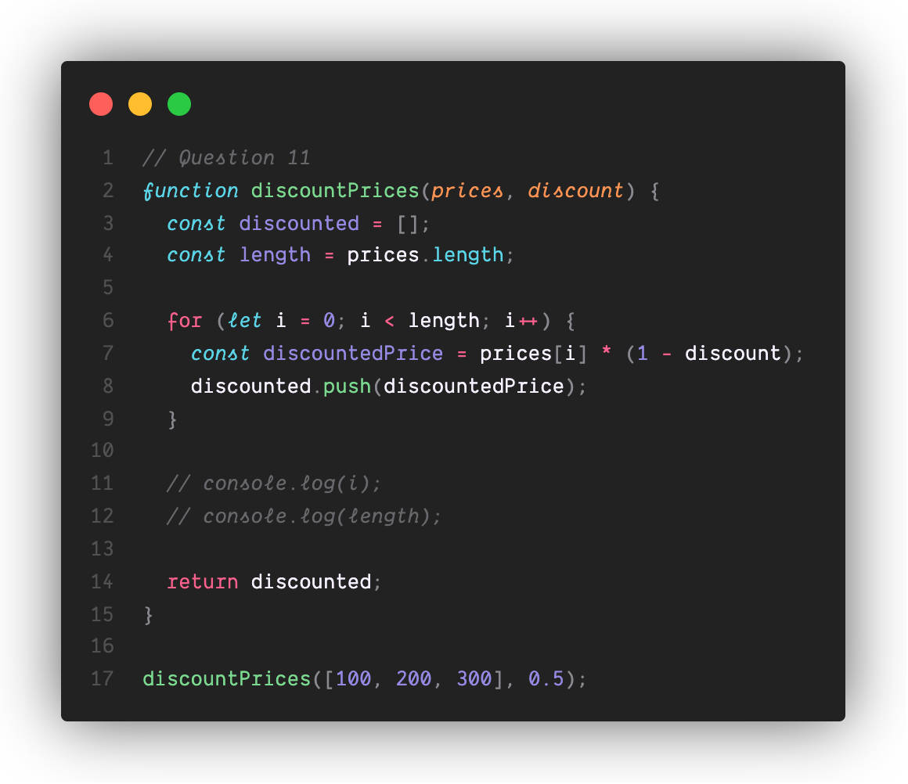

# Part 2. A Little More of a Challenge...

1. Line 12 will return 3, because i as declared with var

2. Line 13 will return 150, because discountedPrice was declared using var it's accessible outside its code block

3. Line 14 will return 150

4. The function will return an array containing the  values [50,100,150]

5. Line 12 will return an error because i was declared using let, so it's not available outside of its for loop block

6. Line 13 will return an error because discountedPrice was declared using let, so it's not available outside of its block

7. Line 14 will return 150

8. The function will return an array containing the  values [50,100,150]

9. Line 11 will return an error because i was declared using let, so it's not available outside of its for loop block

10. Line 12 will return 3

11. The function will return an error because disocunted was declared using const