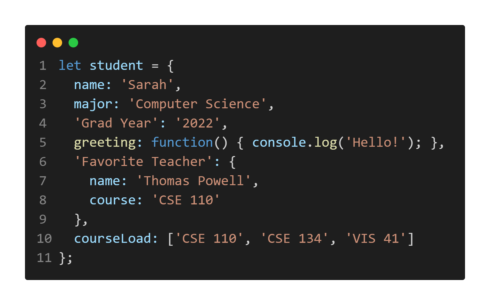
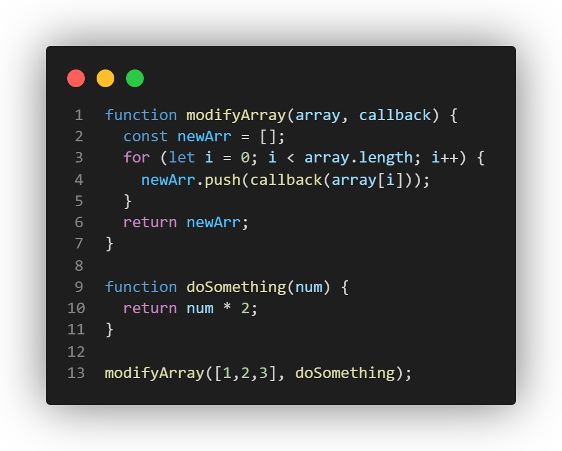

# Part 2. A Little More of a Challenge...

1. Line 12 will return 3, because i as declared with var

2. Line 13 will return 150, because discountedPrice was declared using var it's accessible outside its code block

3. Line 14 will return 150

4. The function will return an array containing the  values [50,100,150]

5. Line 12 will return an error because i was declared using let, so it's not available outside of its for loop block

6. Line 13 will return an error because discountedPrice was declared using let, so it's not available outside of its block

7. Line 14 will return 150

8. The function will return an array containing the  values [50,100,150]

9. Line 11 will return an error because i was declared using let, so it's not available outside of its for loop block

10.  Line 12 will return 3

11.  The function will return an error because disocunted was declared using const

## Data Types

Accessing the value of the name property in the student object: student.name

Accessing the value of the Grad Year property in the student object: student['Grad Year']

Calling the function for the greeting property in the student object: student.greeting()

Accessing the name property of the object in the Favorite Teacher property in student: student['Favorite Teacher'].name

Access index zero in the array of the courseLoad property of the student object: student.courseLoad[0]

## Basic Operators & Type Conversion

13. Arithmetic

    - '3' + 2 : '32' , it treated each as a string and concatenated
    - '3' - 2 : 1 , it treated each as an int and performed subtraction
    - 3 + null : 3 . treated null as 0
    - '3' + null : '3null' , treated both as strings
    - true + 3 : 4 , treated true as 1
    - false + null : 0 , treated both as 0
    - '3' + undefined : '3undefined' , treated both as strings
    - '3' - undefined : Nan , cannot subtract undefined value

14. Comparison

    - '2' > 1 : true , 2 treated as a number is bigger than 1
    - '2' < '12' : false , both are strings
    - 2 == '2' : true , performs type conversion
    - 2 === '2' : false , js has a strict comparison notation that checks if type matches as well
    - true == 2 : false , true would be 1 which is different than 2
    - true == Boolean(2) : true , Boolean(2) is true

## Functions

17. The function modifyArray will create an array newArr and begin a for loop. For each value within the passed array [1,2,3], the loop calls the doSomething function, which takes the value and multiplies it by 2. Those doubled values are pushed within newArr, which is then returned. newArr = [2,4,6]

## setInterval(), setTimeout(), clearTimeout()

19. 1 and 4 are logged immediately, then 3 is logged because setTimeout waits for console.log to finish/the stack to clear, then 2 is logged because it has a 1 second timeout